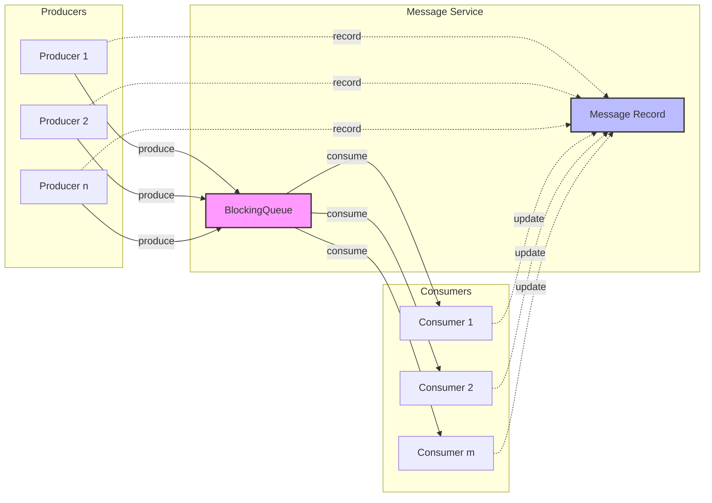

# Async Implementation in Rust, Golang, Scala, and Java

This repository showcases implementations of asynchronous communications in four programming languages: Rust, Golang, Scala, and Java (with separate examples for Gradle and Maven builds). 

## Purpose

The goal of this repository is to help developers understand the fundamental concepts of writing production-grade asynchronous code. It emphasizes:

- **Design Principles**: Following best practices for maintainability and scalability.
- **Project Structure**: Organizing code effectively for real-world applications.
- **Language-Specific Practices**: Adopting idiomatic patterns unique to each programming language.

This repository is ideal for both beginners and experienced developers looking to improve their understanding of asynchronous programming across different languages.

---

## (1) Async Rust Producer-Consumer

> For more details about the `Rust` Producer-Consumer checkout [async-rust](async-rust) subdirectory, and read about the project in detail from the [README in async-rust](async-rust/README.md).

```bash
// ToDO
```

---

## (2) Async Golang Producer-Consumer

> For more details about the `Golang` Producer-Consumer checkout [async-go](async-go) subdirectory, and read about the project in detail from the [README in async-go](async-go/README.md).

```ascii
Producers       Channel       Consumers
[P1] ----\                  /----> [C1]
[P2] -----\   ┌─────────┐  /-----> [C2]
[P3] ------\  │ Message │ /------> [C3]
[P4] -------► │ Queue   │ -------> [C4]
[P5] ------/  │ Buffer  │ \------> [C5]
[P6] -----/   └─────────┘  \-----> [C6]
[P7] ----/                  \----> [C7]

```
```
Metrics & Monitoring
┌────────────────────┐
│ ● Active Count     │
│ ● Message Latency  │
│ ● Error Rate       │
└────────────────────┘
```


### Components

1. **Producers**
   - Independent message producers
   - Asynchronous message generation
   - Configurable production rates
   - Built-in backpressure handling

2. **Message Queue Buffer**
   - Thread-safe implementation
   - Configurable buffer size
   - FIFO (First-In-First-Out) processing
   - Memory-efficient design

3. **Consumers**
   - Parallel message processing
   - Independent consumption rates
   - Error handling and retry mechanisms
   - Scalable consumer groups

## Features

- **High Performance**
  - Non-blocking operations
  - Optimized memory usage
  - Efficient message routing

- **Reliability**
  - Message persistence
  - Transaction support
  - Guaranteed message delivery
  - Fault tolerance

- **Scalability**
  - Horizontal scaling
  - Dynamic producer/consumer addition
  - Load balancing
  - Cluster support

- **Monitoring**
  - Real-time metrics
  - Performance analytics
  - Health checks
  - Alert system

---

## (3) Async Scala Producer-Consumer

> For more details about the `Scala` Producer-Consumer checkout [async-scala](async-scala) subdirectory, and read about the project in detail from the [README in async-scala](async-scala/README.md).

### Message Packet Flow Visualization
```Bash

Producers             Queue                   Consumers
---------          -------------             -----------

P1 ──┐             │           │             ┌── C1
     │             │           │             │
P2 ──┤ ──► FIFO ──►│  Messages │ ──► Consume ┤── C2
     │             │           │             │
P3 ──┤             │           │             ├── C3
     │             │           │             │
P4 ──┘             │           │             └── C4

Legend:
P = Producer
C = Consumer
► = Message Flow
```

### More Detailed Flow:
```Bash
Producer Flow                                Consumer Flow
--------------                              --------------

   ┌─────────────┐                          ┌─────────────┐
   │ Generate ID │                          │   Process   │
   │  (UUID)     │                          │   Message   │
   └─────┬───────┘                          └─────┬───────┘
         │                                        │
         ▼                                        ▼
┌─────────────────┐                     ┌─────────────────┐
│ Add to Channel  │                     │ Remove from     │
│ (Blocking Queue)│ ────────────────►   │ Channel         │
└─────────────────┘                     └─────────────────┘
         │                                        │
         ▼                                        ▼
┌─────────────────┐                     ┌─────────────────┐
│ Track Timestamp │                     │ Calculate       │
│ & Metrics       │                     │ Processing Time │
└─────────────────┘                     └─────────────────┘
```

### Comprehensive Flow Diagram:
```Bash
[Producers]                [Shared Channel]                [Consumers]
    │                         │                               │
    ▼                         ▼                               ▼
┌───────────┐           ┌───────────────┐             ┌───────────────┐
│ Generate  │  ──push── │ LinkedBlocking│  ──poll──   │   Process     │
│ Message   │           │    Queue      │             │   Message     │
│ (UUID)    │           │ (Max Size 100)│             │ (With Delay)  │
└───────────┘           └───────────────┘             └───────────────┘
    │                         │                               │
    ▼                         ▼                               ▼
┌───────────┐           ┌───────────────┐             ┌───────────────┐
│ Log       │           │ Track Message │             │ Log Processing│
│ Produce   │           │   Metrics     │             │   Metrics     │
└───────────┘           └───────────────┘             └───────────────┘
```

### Metrics Tracking Flow:
```Bash
[Message Creation]  ──►  [Queued]  ──►  [Consumed]  ──►  [Processed]
       │                    │              │               │
       ▼                    ▼              ▼               ▼
┌─────────────┐    ┌─────────────┐  ┌─────────────┐  ┌─────────────┐
│ Generate ID │    │ Timestamp   │  │ Start       │  │ Calculate   │
│             │    │ Enqueue     │  │ Processing  │  │ Total Time  │
└─────────────┘    └─────────────┘  └─────────────┘  └─────────────┘
```

### Performance Metrics Capture:
```Bash
Metric Capture Points:
   ┌───────────────┐
   │ Message ID    │
   │ (UUID)        │
   └───┬───────────┘
       │
       ▼
┌─────────────────┐
│ Produce Time    │
│ (Timestamp)     │
└───┬─────────────┘
    │
    ▼
┌─────────────────┐
│ Queue Wait Time │
│                 │
└───┬─────────────┘
    │
    ▼
┌─────────────────┐
│ Consume Time    │
│                 │
└───┬─────────────┘
    │
    ▼
┌─────────────────┐
│ Processing Time │
│ (Total Latency) │
└─────────────────┘
```

### ✨ Features

- Concurrent message production and consumption
- Configurable number of producers and consumers
- Dynamic message generation
- Detailed performance metrics
- Flexible delay ranges
- Comprehensive logging

## 📋 Prerequisites

- Java 11+ (Recommended: Java 17 or 21)
- Scala 2.13.x
- SBT 1.9.x

## 🛠 Technology Stack

- Scala
- SBT (Build Tool)
- ScalaTest (Unit Testing)
- Logback (Logging)
- Scopt (CLI Parsing)

## 📂 Project Structure
```Bash
async-scala/
├── src/
│ ├── main/
│ │ ├── scala/
│ │ │ └── com/example/
│ │ │ ├── Main.scala
│ │ │ ├── ProducerConsumer.scala
│ │ │ ├── ProducerConsumerConfig.scala
│ │ │ └── ProducerConsumerMetrics.scala
│ │ └── resources/
│ │ └── logback.xml
│ └── test/
│ └── scala/
│ └── com/example/
│ └── ProducerConsumerSpec.scala
├── project/
│ └── build.properties
└── build.sbt
```

---

## (4) Async Java (with Gradle) Producer-Consumer

> For more details about the `Java` Producer-Consumer using [Gradle](https://gradle.org/) as build tool, checkout [async-java-gradle](async-java-gradle) subdirectory, and read about the project in detail from the [README in async-java-gradle](async-java-gradle/README.md).

This Java-based application demonstrates a sophisticated concurrent message processing system using the producer-consumer design pattern. It showcases advanced concurrent programming techniques, thread management, and configurable message processing.

## 🔧 System Architecture

### Architectural Diagram
```
+-------------------+     +-------------------+
|    Producers      |     |    Consumers      |
+-------------------+     +-------------------+
| - Generate msgs   |     | - Process msgs    |
| - Put in channel  | --> | - Consume from    |
+-------------------+     |   shared channel  |
                          +-------------------+
                          |   Blocking Queue  |
                          +-------------------+
```

### Message Flow Diagram
```
 Producer 1                Producer 2                Producer N
     |                         |                        |
     v                         v                        v
+--------------------+   +--------------------+   +--------------------+
| Generate Message   |   | Generate Message   |   | Generate Message   |
+--------------------+   +--------------------+   +--------------------+
     |                         |                        |
     |                         |                        |
     v                         v                        v
+------------------------------------------------------------+
|                   Blocking Message Queue                   |
|   [Message 1]  [Message 2]  [Message 3]  ...  [Message N]  |
+------------------------------------------------------------+
     |                         |                        |
     |        Concurrent       |                        |
     |       Consumption       |                        |
     v                         v                        v
+--------------------+   +--------------------+   +--------------------+
| Consumer 1         |   | Consumer 2         |   | Consumer N         |
| - Process Message  |   | - Process Message  |   | - Process Message  |
| - Track Duration   |   | - Track Duration   |   | - Track Duration   |
+--------------------+   +--------------------+   +--------------------+
     |                         |                        |
     v                         v                        v
+------------------------------------------------------------+
|                   Processed Message Results                |
|   [Processed Msg] [Processed Msg] [Processed Msg]          |
+------------------------------------------------------------+
```

---

## (5) Async Java (with Maven) Producer-Consumer Example

> For more details about the `Java` Producer-Consumer with [Maven](https://maven.apache.org/) as build tool, checkout [async-java](async-java) subdirectory, and read about the project in detail from the [README in async-java](async-java/README.md).

This project demonstrates a multi-threaded producer-consumer pattern implementation in Java, showcasing concurrent programming concepts and best practices.

## Project Overview

The application implements a producer-consumer pattern where multiple producers generate messages that are consumed by multiple consumers through a bounded blocking queue. Each message is tracked for its processing time, from production to consumption.

### Key Features

- Multiple concurrent producers and consumers
- Configurable number of producers, consumers, and messages
- Thread-safe message processing
- Processing time tracking for each message
- Graceful shutdown mechanism using poison pill pattern
- Comprehensive test coverage

## Message Flow



### ASCII Message Flow Diagram
```
+-------------+     +-------------------------+     +-------------+
|             |     |     Message Service     |     |             |
| Producers   |     |                         |     | Consumers   |
|             |     |  +---------------+      |     |             |
| +--------+  |     |  |               |      |     | +--------+  |
| |Prod(1) |--+---->|  | BlockingQueue |------+---->| |Cons(1) |  |
| +--------+  |     |  |               |      |     | +--------+  |
|             |     |  +---------------+      |     |             |
| +--------+  |     |          ^              |     | +--------+  |
| |Prod(2) |--+---->|          |              |     | |Cons(2) |  |
| +--------+  |     |          |              |     | +--------+  |
|             |     |  +---------------+      |     |             |
| +--------+  |     |  |   Message     |      |     | +--------+  |
| |Prod(n) |--+....>|  |   Record      |<.....+.....| |Cons(m) |  |
| +--------+  |     |  +---------------+      |     | +--------+  |
|             |     |                         |     |             |
+-------------+     +-------------------------+     +-------------+

Legend:
---> Message Flow
.... State Updates
(n,m) Number of instances
```

The ASCII diagram shows:
- Multiple producers sending messages to the BlockingQueue
- Multiple consumers receiving messages from the BlockingQueue
- Message record keeping track of all messages
- Dotted lines showing state updates
- Solid lines showing message flow

---
