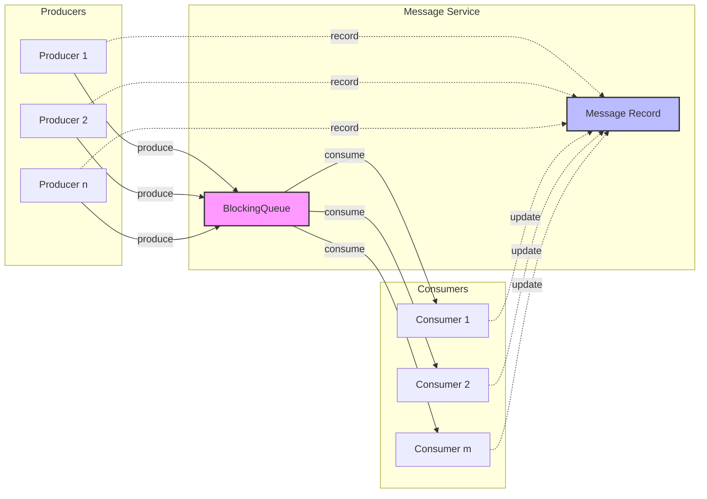

# Async Java Producer-Consumer Example

This project demonstrates a multi-threaded producer-consumer pattern implementation in Java, showcasing concurrent programming concepts and best practices.

## Project Overview

The application implements a producer-consumer pattern where multiple producers generate messages that are consumed by multiple consumers through a bounded blocking queue. Each message is tracked for its processing time, from production to consumption.

### Key Features

- Multiple concurrent producers and consumers
- Configurable number of producers, consumers, and messages
- Thread-safe message processing
- Processing time tracking for each message
- Graceful shutdown mechanism using poison pill pattern
- Comprehensive test coverage

## Message Flow



### ASCII Message Flow Diagram
```
+-------------+     +-------------------------+     +-------------+
|             |     |     Message Service     |     |             |
| Producers   |     |                         |     | Consumers   |
|             |     |  +---------------+      |     |             |
| +--------+  |     |  |               |      |     | +--------+  |
| |Prod(1) |--+---->|  | BlockingQueue |------+---->| |Cons(1) |  |
| +--------+  |     |  |               |      |     | +--------+  |
|             |     |  +---------------+      |     |             |
| +--------+  |     |          ^              |     | +--------+  |
| |Prod(2) |--+---->|          |              |     | |Cons(2) |  |
| +--------+  |     |          |              |     | +--------+  |
|             |     |  +---------------+      |     |             |
| +--------+  |     |  |   Message     |      |     | +--------+  |
| |Prod(n) |--+....>|  |   Record      |<.....+.....| |Cons(m) |  |
| +--------+  |     |  +---------------+      |     | +--------+  |
|             |     |                         |     |             |
+-------------+     +-------------------------+     +-------------+

Legend:
---> Message Flow
.... State Updates
(n,m) Number of instances
```

The ASCII diagram shows:
- Multiple producers sending messages to the BlockingQueue
- Multiple consumers receiving messages from the BlockingQueue
- Message record keeping track of all messages
- Dotted lines showing state updates
- Solid lines showing message flow

### Flow Description

1. **Message Production**
   - Producers generate messages with unique IDs
   - Each message is timestamped at creation
   - Messages are recorded in MessageService
   - Messages are placed in BlockingQueue

2. **Message Processing**
   - Consumers retrieve messages from BlockingQueue
   - Processing time is simulated with delays
   - Messages are marked as consumed
   - Processing time is recorded

3. **Completion**
   - Producers send completion signal (Poison Pill)
   - Consumers gracefully shutdown
   - Final statistics are generated

## Architecture

### Project Structure 
```
src/
├── main/java/com/example/
│ ├── ProducerConsumerApp.java # Main application class
│ ├── config/
│ │ └── AppConfig.java # Configuration settings
│ ├── model/
│ │ └── Message.java # Message entity
│ ├── service/
│ │ └── MessageService.java # Core business logic
│ └── worker/
│ ├── Producer.java # Message producer
│ └── Consumer.java # Message consumer
└── test/java/com/example/
├── integration/
│ └── ProducerConsumerIntegrationTest.java
└── service/
└── MessageServiceTest.java
```


### Components

1. **AppConfig**: Centralized configuration using builder pattern
   - Configurable parameters for producers, consumers, and delays
   - Default values for all settings
   - Immutable configuration using Lombok @Value

2. **Message**: Message entity with timing information
   - Unique ID for each message
   - Start and end time tracking
   - Processing time calculation

3. **MessageService**: Core service managing message flow
   - Thread-safe message recording
   - Blocking queue for producer-consumer communication
   - Synchronized message consumption tracking

4. **Producer**: Message generator
   - Configurable message generation rate
   - Random delays between messages
   - Message timing tracking

5. **Consumer**: Message processor
   - Configurable processing rate
   - Poison pill pattern for graceful shutdown
   - Message completion tracking

## Technologies Used

- Java 11+
- Maven
- Project Lombok
- SLF4J with Logback
- JUnit 5
- Picocli (CLI)

## Getting Started

### Prerequisites

- Java JDK 11 or higher
- Maven 3.6+

### Building the Project
```bash
mvn clean package
```

### Running the Application
```bash
java -jar target/async-java-1.0-SNAPSHOT-jar-with-dependencies.jar
```

### Running the Application with CLI
```bash
java -jar target/async-java-1.0-SNAPSHOT-jar-with-dependencies.jar --producers 2 --consumers 2 --messages 10 --delay 1000
```

### Command Line Options

```bash
- `-p, --producers`: Number of producers (default: 10)
- `-c, --consumers`: Number of consumers (default: 5)
- `-m, --messages`: Messages per producer (default: 5)
- `-h, --help`: Show help message
```

Example:
```bash
java -jar target/async-java-1.0-SNAPSHOT-jar-with-dependencies.jar -p 5 -c 3 -m 10
```

## Testing

The project includes both unit tests and integration tests:

### Run all tests
```bash
mvn test
```

### Run specific test class
```bash
mvn test -Dtest=MessageServiceTest
```


### Test Coverage

- Unit tests for MessageService
- Integration tests for producer-consumer interaction
- Concurrent operation testing
- Timeout testing for blocking operations

## Design Patterns Used

1. **Producer-Consumer Pattern**: Core architectural pattern
2. **Builder Pattern**: Used in AppConfig
3. **Dependency Injection**: Constructor-based DI
4. **Poison Pill Pattern**: For graceful shutdown

## Thread Safety Mechanisms

- ConcurrentHashMap for message recording
- BlockingQueue for producer-consumer communication
- Synchronized blocks for consumer tracking
- Atomic operations for critical sections

## Performance Considerations

- Configurable delays for producers and consumers
- Bounded blocking queue to prevent memory issues
- Efficient thread management using ExecutorService
- Minimal synchronization points

## Contributing

1. Fork the repository
2. Create a feature branch
3. Commit your changes
4. Push to the branch
5. Create a Pull Request

## License

This project is licensed under the MIT License - see the LICENSE file for details.

